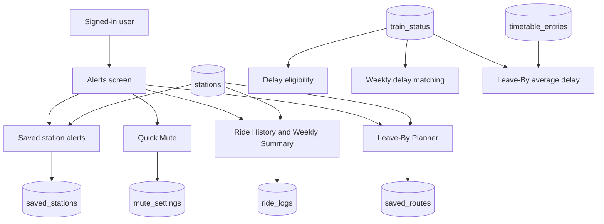
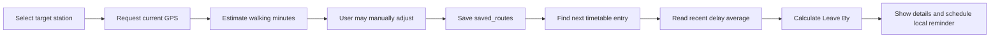

# Module 4 — Personal Alerts: Implementation Guide

Module 4 is the personal-alerts part of OnJejak. It provides station delay alerts, Quick Mute, automatic ride history, a weekly commute summary, and the Leave-By Planner.

## 1. Feature map



The entry point is the Alerts tab in `lib/shared_widgets/app_shell.dart`. `AlertsHomeScreen` provides direct links to Weekly Summary, Leave-By Planner and Quick Mute.

## 2. Flutter architecture

The UI uses Flutter Material widgets and `provider` for state management.

| Layer | Files | Responsibility |
|---|---|---|
| Alerts UI | `lib/modules/alerts/screens/alerts_home_screen.dart` | Shows alert status, saved stations, recent ride history and navigation actions. |
| Alert-rule form | `lib/modules/alerts/screens/alert_rule_edit_screen.dart` | Creates or edits a station rule. |
| Quick Mute UI | `lib/modules/alerts/widgets/quick_mute_card.dart` | Mutes all notification categories until a chosen date. |
| Weekly UI | `lib/modules/alerts/screens/weekly_summary_screen.dart` | Shows a rolling seven-day summary and ride list. |
| Ride details | `lib/modules/alerts/screens/ride_detail_screen.dart` | Displays the known fields for one automatically detected ride. |
| Leave-By UI | `lib/modules/alerts/screens/leave_by_screen.dart` | Displays routes, calculations and delete confirmation. |
| Add route UI | `lib/modules/alerts/screens/add_route_screen.dart` | Selects a target station, gets GPS and saves walking minutes. |
| State | `lib/providers/alerts_provider.dart`, `leave_by_provider.dart`, `weekly_summary_provider.dart` | Loads data, exposes loading/error state and updates the UI through `ChangeNotifier`. |
| Data access | `lib/services/alerts_repository.dart`, `leave_by_repository.dart`, `weekly_summary_repository.dart` | Converts Flutter requests into Supabase calls. |
| Background-like foreground services | `lib/services/delay_alert_service.dart`, `ride_detection_service.dart` | Polls delays and listens for location updates while the app is active. |

Important package imports are:

| Import/package | Use |
|---|---|
| `package:flutter/material.dart` | Screens, dialogs, cards, sliders, buttons and navigation. |
| `package:provider/provider.dart` | Makes provider state available to widgets. |
| `package:supabase_flutter/supabase_flutter.dart` | Session-aware Supabase Edge Function calls and route queries. |
| `package:location/location.dart` | GPS permissions, single locations and position streams. |
| `package:flutter_local_notifications/flutter_local_notifications.dart` | Android/iOS local notifications. |
| `package:timezone/timezone.dart` | Correct MYT notification scheduling. |
| `dart:math` | Haversine geographical-distance calculation. |

## 3. Authentication and access control

`main.dart` initializes Supabase and local notifications. `AuthGate` listens to the Supabase authentication state. A valid session opens `AppShell`; otherwise, the user sees the login screen.

When a session starts, the app starts `DelayAlertService` and `RideDetectionService`. When the session ends, both services stop.

Most API calls go through `lib/services/edge_function_client.dart`:

```dart
SupabaseService.client.functions.invoke(functionName, ...)
```

Every Module 4 Edge Function uses `requireUser(...)`. It reads the current session token and obtains the authenticated user ID. Database queries then filter on `user_id`, so an update or delete only affects that user's records.

## 4. Data sets and tables

| Table | Important fields | Module 4 use |
|---|---|---|
| `stations` | `id`, `name`, `line`, `lat`, `lng` | Station selection, names, lines and GPS distance calculations. |
| `train_status` | `station_id`, `delay_minutes`, `recorded_at`, `actual_time` | Delay notifications, weekly delay matching and Leave-By delay averages. |
| `timetable_entries` | `station_id`, `scheduled_time`, `line`, `direction` | Finds the next scheduled train for Leave-By. |
| `saved_stations` | `user_id`, `station_id`, threshold, quiet hours, days, `enabled` | Stores personal delay-alert rules. |
| `mute_settings` | `user_id`, `muted_until` | Stores a user-wide mute date. |
| `ride_logs` | `user_id`, origin station, destination station, time, duration | Stores automatically detected trips. |
| `saved_routes` | `user_id`, `origin_station_id`, `walking_minutes` | Stores Leave-By preferences. |

`saved_routes.origin_station_id` is a historical database field name. In the current Leave-By product flow it means the **target station where the user intends to catch a train**. `destination_station_id` is optional and is normally `NULL`.

Database timestamps and Edge Function timestamps are UTC ISO-8601 instants. User-facing times and notification times are converted to `Asia/Kuala_Lumpur` (MYT, UTC+8).

## 5. Saved station delay alerts

### User flow

1. The user chooses **Add station** on Alerts.
2. The user selects a station.
3. The user sets the rule in `AlertRuleEditScreen`.
4. The app saves the rule with `upsert-saved-station`.
5. `DelayAlertService` checks the rule continuously while the user is signed in.

The rule fields are:

```text
station_id               Station to monitor
alert_delay_threshold    Minutes delayed before an alert is allowed
quiet_hours_start/end    Optional notification-suppression range
active_days              Mon, Tue, Wed, Thu, Fri, Sat and/or Sun
enabled                  Keep the rule without deleting it
```

The form validates that both quiet-hour values are supplied together and that at least one active day is selected.

### APIs

| Function | Method | Purpose |
|---|---|---|
| `get-saved-stations` | GET | Returns current-user rules joined to `stations(name, line)`. |
| `upsert-saved-station` | POST | Inserts a new rule or updates an existing rule. |
| `toggle-saved-station` | PATCH | Changes only `enabled`. |
| `delete-saved-station` | DELETE | Deletes one owned rule. |
| `get-recent-train-delays` | GET | Supplies current train-status data to the polling service. |

### Notification eligibility

`DelayAlertService` runs a check every minute. A notification is sent only when all conditions are true:

```text
1. enabled is true.
2. Today is included in active_days.
3. The current time is outside Quiet Hours.
4. The user is not muted.
5. delay_minutes is strictly greater than alert_delay_threshold.
6. The train_status record is no more than 15 minutes old.
7. The rule/status pair has not already been notified.
```

The comparison is strict: a five-minute threshold does not notify at exactly five minutes; it notifies from six minutes onward.

Quiet hours support crossing midnight. For example, `22:00` to `06:00` means notifications are disabled from 10 PM until 6 AM the next day.

## 6. Quick Mute

Quick Mute is a user-wide notification pause, not a deletion of alert rules or routes.

`mute_settings.muted_until` is a date. A mute remains active until the start of the day after that date. For example, `2026-09-10` means alerts remain muted for the whole of 10 September and resume on 11 September.

| Function | Method | Purpose |
|---|---|---|
| `get-mute-settings` | GET | Reads the current mute date. |
| `set-mute-settings` | POST | Upserts the mute date, or clears it with `null`. |

Mute affects delay alerts, Leave-By reminders and Weekly Summary notifications. When the user turns mute on, `AlertsProvider` also cancels already scheduled Leave-By alarms. This is necessary because merely skipping a future schedule call would not remove an alarm already held by Android.

## 7. Automatic ride detection and Ride History

Ride History is read-only. Users do not manually add rides.

### Location flow

1. After login, `RideDetectionService` requests location permission through `LocationService`.
2. It loads all records from `stations`.
3. It listens to location changes while the application is in the foreground.
4. It ignores a location outside the Malaysian commute windows: 07:00–09:59 and 17:00–19:59 MYT.
5. It finds the nearest station within 150 metres.
6. The first station becomes the open-trip origin.
7. Arrival at a different station creates a completed trip.

The trip is discarded if the open origin is older than three hours. The service is deliberately foreground-only: it does not request background location permission and does not track users when the app is closed.

The detector checks all stations, not only stations saved as alert rules. The Weekly Summary empty state intentionally says “near a station” to match this implementation.

### Distance rule

The service and Add Route screen use the Haversine formula:

```text
R = 6,371,000 metres

a = sin²(Δlatitude / 2)
  + cos(latitude1) × cos(latitude2) × sin²(Δlongitude / 2)

distance = 2R × atan2(√a, √(1-a))
```

For ride detection, a station is considered reached when `distance <= 150 metres`.

### Stored ride

When the user reaches a different station, `log-ride` inserts:

```text
station_id               First station reached: trip origin
destination_station_id   Second, different station reached
duration_minutes         Time between the two detections
detected_at              Server UTC timestamp
user_id                  Authenticated user
```

`get-recent-rides` joins origin and destination station names so the Alerts homepage can show a readable route and open `RideDetailScreen`.

## 8. Weekly Summary

The Weekly Summary is a rolling last-seven-days view, not a fixed Monday-to-Sunday calendar week.

### API and database RPC

`get-weekly-rides` calls this PostgreSQL RPC:

```text
weekly_ride_summary(p_user_id, p_since, p_threshold = 5)
```

For every `ride_logs` row after `p_since`, the SQL function finds the closest `train_status` row at the same origin station where `recorded_at` is within plus or minus 60 minutes of `detected_at`.

It then calculates:

```text
on-time condition: delay_minutes <= 5

on-time percentage:
on-time matched rides / all matched rides × 100

average delay:
average delay_minutes across matched rides that were late (`delay_minutes > 0`)
```

Early arrivals do not offset late trains in the displayed average. For example, delays of `8`, `10`, `-4` and `-3` minutes display an average delay of `9` minutes. If no ride has a matching train-status record, percentage and average delay are `null`, not zero. The UI displays “Not enough data yet” so it does not make a false claim that trains were on time.

Weekly Summary lists station name, MYT date/time and delay. Tapping it opens Ride Detail. Weekly data is intentionally lightweight, so destination, duration and line can be unavailable in that detail view; Alerts Recent Ride History uses the full `ride_logs` query and can show more fields.

`WeeklySummaryProvider` shows a local weekly notification only once per user during the app process. It is also blocked by Quick Mute.

## 9. Leave-By Planner

### User flow



The user selects only one station: the station they want to catch a train from. The user does not choose a destination station.

### Walking-time estimate

`AddRouteScreen` requests one current GPS location. It applies the Haversine formula above and assumes a walking speed of 75 metres per minute:

```text
walking_minutes = ceil(distance_metres / 75)
```

The value is clamped from 1 to 120 minutes. GPS has an eight-second timeout. If location permission is refused, GPS is unavailable, or an emulator does not supply a location, the user can still manually drag the slider and save the route.

### APIs

| Function/query | Method | Purpose |
|---|---|---|
| Direct `saved_routes` query | SELECT | Lists current-user routes joined to target station name and line. |
| `upsert-saved-route` | POST | Inserts or updates a target station and walking minutes. |
| `delete-saved-route` | DELETE | Deletes one owned route after user confirmation. |
| `compute-leave-by-time` | GET | Returns the next train, delay evidence and recommended departure time. |

The route-list query explicitly filters by the current user's `user_id` and ignores malformed rows. It accepts `destination_station_id = NULL`.

### Leave-By calculation

`compute-leave-by-time` performs these steps:

1. Read the saved route's target station and walking minutes.
2. Convert the current instant to Kuala Lumpur time.
3. Query `timetable_entries` for the first scheduled time at or after now for that target station.
4. Call `avg_recent_delay_minutes(target_station, 30)`.
5. Average the newest 30 `train_status.delay_minutes` values that are not null.
6. Return the times as UTC ISO-8601 values.

The formula is:

```text
estimated actual departure
= scheduled departure + round(average delay)

leave-by time
= estimated actual departure - walking minutes
```

Example:

```text
Scheduled train: 22:51
Average delay: 6 minutes
Walking time: 10 minutes

Estimated actual departure: 22:57
Recommended Leave By: 22:47
```

The Planner card displays target station, walking time, next scheduled train, average delay, delay sample size and Leave-By time. Deletion always uses a confirmation dialog.

## 10. Local notifications and time zones

`NotificationService` initializes `flutter_local_notifications`, then sets its local timezone to `Asia/Kuala_Lumpur`.

It creates three notification categories:

| Category | Trigger |
|---|---|
| Train Delay Alerts | A saved-station rule passes all eligibility checks. |
| Weekly Commute Summary | Weekly data is loaded, contains rides and the user is not muted. |
| Leave-By Reminders | A route has a future calculated Leave-By time and enough delay data. |

Leave-By values are returned from the server as UTC. Flutter converts them with `MalaysiaTime.fromUtc(...)` before displaying and scheduling. This prevents a device configured to another timezone from displaying KTM departure times incorrectly.

## 11. Server deployment note

The `module4` Git branch contains the current source for all Flutter files and Edge Functions. Pushing Git code does not automatically deploy Edge Functions to Supabase.

The current application lists routes directly from `saved_routes`, so existing routes with a null `destination_station_id` can display. The matching backend sources are in:

```text
supabase/functions/get-saved-routes/index.ts
supabase/functions/upsert-saved-route/index.ts
supabase/functions/compute-leave-by-time/index.ts
```

Deploy those functions through the Supabase CLI or Supabase Dashboard when backend deployment access is available, so the production functions exactly match this branch.
